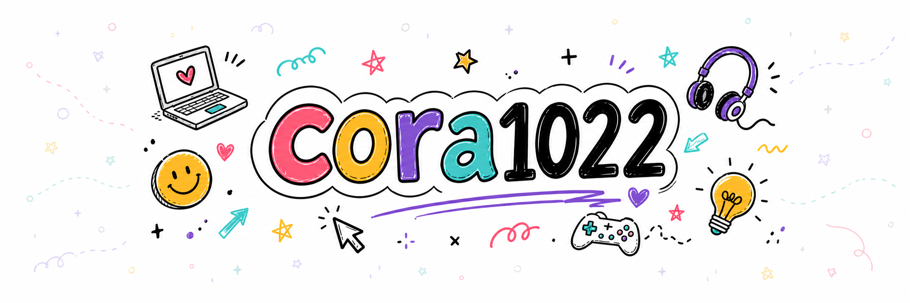
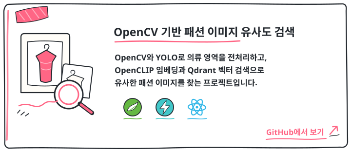
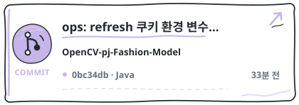
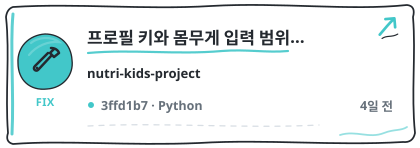
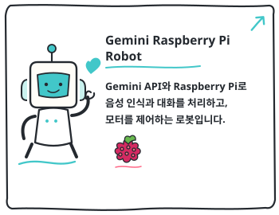
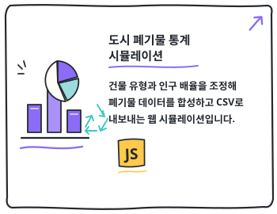
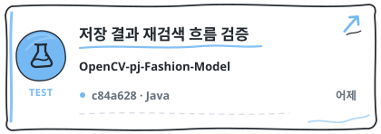

  

  <picture>
    <source media="(prefers-color-scheme: dark)" srcset="https://readme-typing-svg.demolab.com?font=Nanum+Pen+Script&amp;weight=400&amp;size=32&amp;duration=3200&amp;pause=0&amp;color=E6EDF3&amp;center=true&amp;vCenter=true&amp;multiline=true&amp;repeat=false&amp;width=900&amp;height=90&amp;lines=%EC%83%88%EB%A1%9C%EC%9A%B4%20%EA%B8%B0%EC%88%A0%EA%B3%BC%20%EC%95%84%EC%9D%B4%EB%94%94%EC%96%B4%EC%97%90%20%ED%98%B8%EA%B8%B0%EC%8B%AC%EC%9D%B4%20%EB%A7%8E%EA%B3%A0%2C;%EA%B4%80%EC%8B%AC%20%EC%9E%88%EB%8A%94%20%EA%B2%83%EC%9D%84%20%EC%A7%81%EC%A0%91%20%EB%A7%8C%EB%93%A4%EC%96%B4%20%EB%B3%B4%EB%A9%B0%20%EB%B0%B0%EC%9A%B0%EB%8A%94%20%EA%B0%9C%EB%B0%9C%EC%9E%90" />
    <source media="(prefers-color-scheme: light)" srcset="https://readme-typing-svg.demolab.com?font=Nanum+Pen+Script&amp;weight=400&amp;size=32&amp;duration=3200&amp;pause=0&amp;color=000000&amp;center=true&amp;vCenter=true&amp;multiline=true&amp;repeat=false&amp;width=900&amp;height=90&amp;lines=%EC%83%88%EB%A1%9C%EC%9A%B4%20%EA%B8%B0%EC%88%A0%EA%B3%BC%20%EC%95%84%EC%9D%B4%EB%94%94%EC%96%B4%EC%97%90%20%ED%98%B8%EA%B8%B0%EC%8B%AC%EC%9D%B4%20%EB%A7%8E%EA%B3%A0%2C;%EA%B4%80%EC%8B%AC%20%EC%9E%88%EB%8A%94%20%EA%B2%83%EC%9D%84%20%EC%A7%81%EC%A0%91%20%EB%A7%8C%EB%93%A4%EC%96%B4%20%EB%B3%B4%EB%A9%B0%20%EB%B0%B0%EC%9A%B0%EB%8A%94%20%EA%B0%9C%EB%B0%9C%EC%9E%90" />
    
  </picture>

- 서비스: [cora1022.com](https://cora1022.com/)
- 프로필: [cora1022.com/profile](https://cora1022.com/profile/)
- 개발기록: [cora1022.com/blog](https://cora1022.com/blog/)

- Spring Boot와 FastAPI 기반 API 설계
- JavaScript와 TypeScript, React를 활용한 페이지 구성
- 알고리즘 자료구조 PS 문제 풀이 
- MySQL을 활용한 데이터 모델링
- Docker를 활용한 배포 흐름

<!-- PROFILE_SHOWCASE_START -->

<!-- RECENT_COMMITS_START -->

  
  
   
  
<!-- RECENT_COMMIT_1_START -->
  
<!-- RECENT_COMMIT_1_END -->
<!-- RECENT_COMMIT_2_START -->
  
<!-- RECENT_COMMIT_2_END -->
   
  
  
<!-- RECENT_COMMIT_3_START -->
  
<!-- RECENT_COMMIT_3_END -->
   

<!-- RECENT_COMMITS_END -->

<!-- PROFILE_SHOWCASE_END -->

개발 과정에서 남긴 생각과 시행착오는 별도 개발기록 페이지에 정리하고 있습니다.

- 알고리즘 문제 풀이를 꾸준히 진행해 과거 백준 **Gold V**를 달성했습니다.
- **NYPC 마스터트랙 NEXT NATION**에 참가해 전략 봇을 설계하고 제출 버전을 반복 개선했습니다. [NYPC 참가 타임라인](https://cora1022.com/blog/posts/nypc-participation-timeline.html)
- **MEDICAL HACK 2026**에 참여했습니다. [AI 기반 질환 맞춤형 식단 영양분석 서비스](https://cora1022.com/blog/posts/medical-hack-diet-analysis.html)
